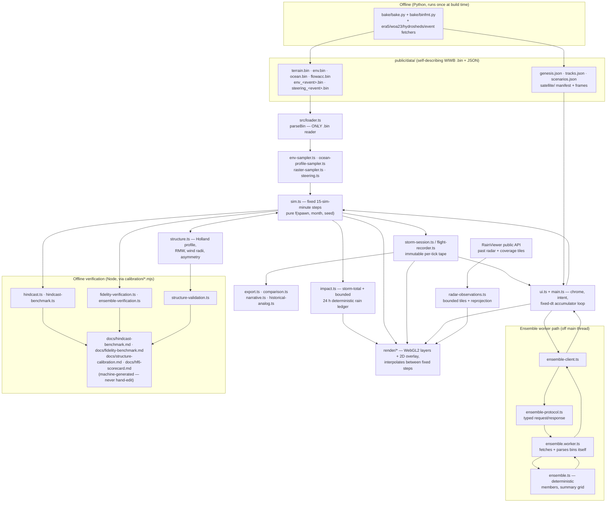

# Architecture

Module map and data-flow reference for a developer or agent landing cold.
Everything below was read from the code on 2026-07-27; when this document and
the code disagree, the code wins.

## System overview

Wallah It's Windy is a browser Arabian Sea tropical-cyclone simulator: Vite +
vanilla TypeScript + WebGL2, zero runtime dependencies (dev-only: vite,
typescript, vitest). An offline Python bake pipeline (`bake/`) turns public
geodata (GMRT, OISST, ERA5, WOA23, HydroSHEDS, IBTrACS) into small
self-describing `.bin` rasters plus JSON catalogues under `public/data/`;
`src/loader.ts` is the only reader of the binary format. The physics core
(`src/sim.ts`) advances a single storm on a fixed 15-simulated-minute timestep
and is a pure function of (spawn point, month, seed) — all randomness flows
through a seeded mulberry32 RNG, so a URL hash replays the identical storm. A
flight recorder tapes every tick for debrief, replay, comparison, and export.
Rendering (WebGL2 layers plus a Canvas2D overlay) interpolates between fixed
steps and adapts to the device, but never feeds back into physics. A dedicated
Web Worker runs deterministic ensembles and sensitivity experiments off the
main thread, and browser-neutral verification modules are driven by Node
scripts in `calibration/` to regenerate the benchmark reports in `docs/`.

## Data flow

Notes verified in code:

- The browser loads `terrain.bin`, `env.bin`, `ocean.bin`, `flowacc.bin`,
  `genesis.json`, `tracks.json`, `scenarios.json` progressively (the
  `MANIFEST` list in `main.ts`); event bins (`env_gonu.bin`, ...) load on
  scenario switch.
- `env.bin` encodes the month in the layer *name* (`sst_MM`, `u_MM`, ...); the
  `nt` axis holds either distinct real years (synoptic-plane mode, seed picks
  `seed % nt`) or event timesteps (event-timeline mode). See BINARY-FORMATS.md.
- The worker does not share parsed bins with the main thread: it fetches and
  parses its own copies by URL and keeps a private cache.
- `calibration/*.mjs` scripts load the exact runtime modules (via
  `vite.ssrLoadModule` or direct TS import) so offline scores cannot drift
  from what the browser ships.

## Module inventory

### src/ — contracts and shared math

| file | responsibility | key exports |
|---|---|---|
| `types.ts` | The shared contract surface between sim, render, ui, and data builders. Interfaces, enums, and a few shared constants (`DType`, `MUSCAT`, `AFTERMATH_FADE_MS`); no runtime logic. | `StormState`, `SpawnParams`, `FrameState`, `RenderLayer`, `SimEngine`, `EnvSampler`, `ParsedBin`, `BinLayer`, `EnvSamplingMode` |
| `grid.ts` | THE coordinate-convention owner: latlon ↔ grid cell ↔ clip space, wind m/s → deg/h, distances. Inline coordinate math elsewhere is a bug. | `DOMAIN` (50–70°E, 15–27°N), `latLonToCell`, `latLonToClip`, `offsetKm`, `greatCircleKm`, `windToDegPerHour` |
| `rng.ts` | Seeded determinism + the shareable-storm URL hash. Never `Math.random()` in sim code. | `mulberry32`, `makeRng`, `randomSeed`, `readHash`/`encodeHash`/`writeHash` |
| `category.ts` | Secondary Saffir–Simpson comparison palette for legacy diagnostics and track colours. | `CATEGORIES`, `stormCategory`, `categoryRgba`, `intensityFraction` |
| `wind-conventions.ts` | North Indian Ocean regional classes plus explicit simulator wind averaging, height, exposure, measure, source, and conversion metadata. | `SIMULATED_WIND_CONVENTION`, `NORTH_INDIAN_OCEAN_CATEGORIES`, `northIndianOceanClassification` |
| `product-identity.ts` | Pure product-mode, model-valid-time, and observation-sync boundary used by the permanent UI identity. | `buildProductIdentity`, `modelValidTimeIso`, `requiresObservationAcknowledgement` |
| `tokens.ts` | The ONE design-token source: map palette + windy-grade chrome tokens (panel glass, radii, typography colours) mirrored as CSS custom properties and normalized Float32 shader uniforms. | `TOKENS`, `uniform`, `injectCssVars`, `SPACING_UNIT`, `RADIUS`, `PANEL_GLASS` |

### src/ — data loading and sampling

| file | responsibility | key exports |
|---|---|---|
| `loader.ts` | Parser for the self-describing WIWB `.bin` format; the ONLY reader. Validates magic + version loudly, dequantizes to Float32. | `parseBin`, `layerGridSpec`, `FORMAT_MAGIC`, `FORMAT_VERSION` |
| `raster-sampler.ts` | Bilinear CPU sampling of one decoded raster plane, clamped to edges. | `sampleLayerBilinear` |
| `env-sampler.ts` | Builds the `EnvSampler` the sim runs on: prefers baked `env.bin`, falls back to analytic climatology on 404. Owns synoptic-plane vs event-timeline selection. | `makeEnvSampler`, `sampleEnvBin`, `envMonthSuffix`, `synopticCount` |
| `ocean-profile-sampler.ts` | Bilinear reader for the WOA23 temperature/salinity profile bin (`ocean.bin` and event ocean bins). | `sampleOceanProfileBin`, `sampleEventOceanProfileBin` |

### src/ — physics core

| file | responsibility | key exports |
|---|---|---|
| `sim.ts` | The physics core: steering + beta drift + seeded wander advection, convective organization, DeMaria–Kaplan-style intensity ODE, land decay, dry-air/shear penalties, precipitation rates. Pure f(spawn, month, seed). | `createSimEngine`, `SIM`, `IntensityParameters`, `TrackParameters`, `mpiKt`, `intensityRateKtPerH`, `precipitationRates` |
| `structure.ts` | Parametric physical structure: Holland (1980) radial wind, Willoughby–Rahn RMW, persistent outer size, shear/motion asymmetry, quadrant 34/50/64-kt radii. | `deriveStormStructure`, `DEFAULT_STRUCTURE_PARAMETERS`, `hollandWindSpeedKt`, `windRadiusAtBearingKm`, `interpolateStormStructure` |
| `steering.ts` | HF-3 environmental steering from vortex-filtered pressure-level sidecars; eight-point environmental ring; falls back to baked deep-layer wind. | `sampleEnvironmentalSteering`, `steeringWeights`, `pressureWindSamplerFromBin`, `observedInitialMotionMs` |
| `upper-ocean.ts` | Deterministic reduced Price/PWP-style 1-D upper-ocean column model: wind stress, bulk-Richardson entrainment, cold wake, recovery. | `SparseUpperOcean`, `OCEAN`, `oceanHeatContentKjCm2`, `profileFromSstAndOhc`, `dragCoefficient` |
| `ventilation.ts` | Annular environmental ventilation diagnostics (HF-2B): mean RH/shear around the storm. | `sampleVentilationEnvironment`, `VentilationDiagnostics` |
| `coastal-exposure.ts` | Continuous inner/outer-vortex land and terrain exposure (HF-2C), sampled on 16 bearings. | `sampleCoastalExposure`, `CoastalExposure` |
| `hydro-routing.ts` | Shared HydroSHEDS D8 routing contract: one TS table generates both the GLSL mapping and the deterministic CPU oracle. | `D8_DIRECTIONS`, `d8Offset`, `flowOffsetGlsl`, `routePulseStep` |

### src/ — storm lifecycle, tape, and derived products

| file | responsibility | key exports |
|---|---|---|
| `storm-session.ts` | Lifecycle + replay transport for one deterministic run: recording, pause, seeking, replay playback, paired-run baseline. Recorded frames never drive the live engine. | `StormSession` |
| `flight-recorder.ts` | Immutable per-tick storm history for debrief and replay; scrubbing rebuilds state from copied frames. | `FlightRecorder`, `FlightFrame`, `FlightRunSnapshot`, `StormDebrief`, `compassDirection` |
| `comparison.ts` | Pure paired-run analysis: same genesis + seed, environment changed; validates that invariant. | `compareRuns`, `RunComparison` |
| `impact.ts` | Deterministic landfall-impact bookkeeping: storm-total rain, a 96-step/24-hour tick ring for 1/3/6/24-hour display windows, and per-city wind/rain/flood-tier table. The selected display window never changes storm-total impact state. | `ImpactTracker`, `IMPACT_CITIES`, `floodRiskTier`, `windAtPointKt`, `experiencedWindPhrase` |
| `rain-accumulation.ts` | Fixed accumulation-window definitions, physical millimetre breaks, and piecewise GPU normalization. No DOM or wall clock. | `RAIN_ACCUMULATION_WINDOWS`, `rainAccumulationDefinition`, `normalizeRainAccumulationMm` |
| `narrative.ts` | Translates the exact intensity budget into one causal sentence. | `explainIntensity`, `CausalNarrative` |
| `intensity-sparkline.ts` | Pure geometry for the flight-tape wind-vs-time sparkline. | `buildIntensitySparkline`, `nearestIntensityIndex` |
| `point-probe.ts` | Pure point-probe reading from the same environment + vortex data the sim uses, with selected-window rain supplied by the deterministic impact ledger; DOM positioning lives in main/ui. | `createPointProbeReading`, `PointProbeReading` |
| `export.ts` | Dependency-free storm artifacts: PNG debrief card and WebM replay loop rendered from the immutable tape, never by rewinding the engine. | `makeDebriefCard`, `makeReplayVideo`, `exportFileStem`, `downloadBlob` |
| `historical-analog.ts` | Deterministic geometric/intensity similarity against shipped historic ghosts; educational analogue, not a forecast claim. | `findHistoricalAnalog`, `HistoricalAnalog` |
| `storm-names.ts` | Versioned WMO/ESCAP North Indian Ocean naming roster; names identify simulations only. | `simulatedStormName`, `NORTH_INDIAN_OCEAN_NAMES` |

### src/ — catalogues and static data models

| file | responsibility | key exports |
|---|---|---|
| `scenarios.ts` | Historic-event catalogue validation + the pure decisions of a scenario switch (env mode, spawn); DOM-free half of the scenario runtime. Malformed JSON degrades to null, never throws. | `parseScenarios`, `Scenario`, `eventSpawn`, `samplingModeForSpawn`, `validateEventBinForScenario` |
| `tracks.ts` | IBTrACS historic-track parsing + ghost polyline projection + label anchoring; DOM-free, degrades to null on bad shape. | `parseTracks`, `StormTrack`, `toGhostPolylines`, `computeLabelAnchors` |
| `weather-layers.ts` | User-facing weather-map layer catalogue + legends + per-layer rail icon SVG (`iconSvg`, required on every entry). Array order is load-bearing: it is the layer rail order AND the Digit1..9 keyboard mapping. | `WEATHER_LAYERS`, `WeatherLayerId`, `SATELLITE_PALETTES`, `DEFAULT_WEATHER_LAYER` |
| `satellite-observations.ts` | Observed satellite frame manifest parsing, timestamp slot matching, Meteosat/INSAT URL builders, image loading. | `parseSatelliteManifest`, `matchObservedFrame`, `acquisitionSlotIso`, `loadObservedFrameImage` |
| `radar-observations.ts` | Wall-clock observed-radar boundary: validates RainViewer's public manifest, caps the recent loop, builds provider tile URLs, and reprojects six-tile Web-Mercator mosaics onto the fixed app domain. Pixels never enter model state. | `parseRadarTimeline`, `recentRadarFrames`, `loadRadarMosaic`, `loadRadarCoverageFraction` |

### src/ — ensemble worker path

| file | responsibility | key exports |
|---|---|---|
| `ensemble.ts` | Deterministic ensemble + sensitivity runner shared by worker, tests, and offline calibration. No DOM, no wall clock. | `runStorm`, `makeEnsembleMembers`, `perturbEnvironment`, `summarizeEnsemble`, `runEnsemble`, `EnsembleResult` |
| `ensemble-protocol.ts` | Typed worker request/response messages (ensemble, sensitivity, progress, error), correlated by `requestId`. | `AnalysisWorkerRequest`, `AnalysisWorkerResponse`, `SensitivityResult` |
| `ensemble.worker.ts` | The dedicated worker: fetches + parses its own bins (private cache), builds samplers, runs members, posts progress, transfers the probability grid buffer. | (worker entry, no exports) |
| `ensemble-client.ts` | Main-thread client: lazy single worker, pending-request map, progress callbacks, terminates + rejects all on worker error. | `requestEnsemble`, `requestSensitivity` |

### src/ — offline verification (browser-neutral)

| file | responsibility | key exports |
|---|---|---|
| `hindcast.ts` | Pure hindcast scoring against observed IBTrACS fixes (track/intensity/pressure errors). | `scoreHindcast`, `HindcastScore` |
| `hindcast-benchmark.ts` | Deterministic multi-storm replay benchmark driving the exact browser sim against frozen event bins; no post-initialization assimilation. | `runHindcastCase`, `runDetailedHindcastCase`, `evaluateHindcastCases`, `aggregateHindcasts` |
| `fidelity-verification.ts` | Lead-time verification (12/24/48/72 h) vs a persistence baseline + bootstrap confidence intervals. | `verifyLeadTimes`, `aggregateLeadTimes`, `trainClimatologyPersistence`, `bootstrapMeanInterval` |
| `ensemble-verification.ts` | HF-4 probabilistic verification: CRPS, cone coverage calibration by lead. | `verifyEnsembleLeads`, `calibrateCone`, `ensembleCrps`, `aggregateEnsembleVerification` |
| `structure-validation.ts` | North Indian Ocean structure validation + constrained calibration; imports the exact runtime structure model so reports cannot drift from it. | `evaluateStructureModel`, `calibrateStructureModel`, `splitStructureStorms`, `liveParametersMatchCalibration` |

### src/ — live data boundary (HF-5)

| file | responsibility | key exports |
|---|---|---|
| `live-data.ts` | Provider-neutral live-data contracts + normalization (units, wind averaging) + input gating. No network or filesystem access. | `normalizeAdvisory`, `evaluateLiveInputs`, `validateArchivedRun`, `speedToKt`, `ArchivedForecastRun` |
| `live-providers.ts` | Provider descriptors and the JSON cycle adapter; NOMADS GFS product URL builder. | `HF5_PROVIDER_DESCRIPTORS`, `JsonCycleAdapter`, `buildNomadsGfsProducts` |
| `live-product.ts` | DOM-free presentation model for an immutable issued forecast cycle. | `buildLiveProductView`, `fetchIssuedLiveRun` |

### src/ — shell, UI, and misc

| file | responsibility | key exports |
|---|---|---|
| `main.ts` | Composition root: boots chrome, WebGL2 + 2D overlay contexts, progressive asset loading (`MANIFEST`), constructs sim + renderer, runs the fixed-dt accumulator loop (`SIM_DT_MIN = 15`), wires the layer rail, keyboard, export buttons, worker requests. | (app entry) |
| `ui.ts` | The UI brain: loading/demo/idle captions, spawn intent, epitaphs, month re-spawn, slow-mo pacing (`timescaleHoursPerSec`), flight-tape view, and the windy-grade chrome — bottom timeline bar (category-gradient scrubber via `timeline-gradient.ts`, age-positioned category milestones, live wind/pressure cluster), storm tag pinned to the vortex eye (`storm-tag.ts` copy), catalogue icons mounted on the layer rail. Pure presentation + intent; never touches WebGL or physics. | `UiController`, `StormTagView`, `epitaph`, `deathReasonPhrase` |
| `timeline-gradient.ts` | Pure: flight-recorder intensity frames in, hard-stop `linear-gradient(90deg, …)` string out — paints the bottom timeline scrubber category-by-category (discrete stops at category boundaries, no blending). | `categoryGradientCss` |
| `storm-tag.ts` | Pure copy for the map chip pinned to the simulated eye: two compact lines (NAME · kt / category · trend · hPa), trend classified from instantaneous kt/h, category vocabulary from the shared SSHS table. DOM anchoring/positioning lives in `ui.ts`. | `formatStormTag`, `StormTagInput`, `StormTagCopy` |
| `tap-gesture.ts` | Distinguishes an intentional map tap from drag/pinch input. | `TapGesture` |
| `performance.ts` | Deterministic render budgets from observable device traits; backing resolution, particle counts, and a compact-chrome flag adapt — never physics. | `chooseRenderProfile`, `RenderProfile` |
| `style.css` | The windy-grade glass chrome (panel material, icon rail, hint chips, timeline bar, storm-tag chip); colours and radii come from CSS vars injected by `tokens.ts`. | (stylesheet) |
| `fonts/` | Self-hosted IBM Plex Mono woff2 (400/500). | (assets) |

### src/render/ — WebGL2 pipeline

| file | responsibility | key exports |
|---|---|---|
| `index.ts` | The render facade implementing the public `RenderLayer` contract; owns layer construction, GPU texture bundle, and per-frame composition in luminance order: terrain → observed satellite → env glow → simulated/observed radar → rain → wind/particles → ghosts → track. | `RenderPipeline`, `createRenderer`, `createRenderLayers`, `RenderResources` |
| `context.ts` | Internal seam: the facade derives a richer `DrawCtx` (interpolated centre in clip space, env at storm, aftermath fade, texture bundle) once per frame for the layer modules. Not exported to other builders. | `DrawCtx`, `GpuTextures`, `RenderModule`, `EnvAtStorm` |
| `gl-utils.ts` | Thin WebGL2 helpers: program compile/link with loud errors, fullscreen quad VAO, render targets with half-float → UNSIGNED_BYTE fallback. | `makeProgram`, `makeQuadVao`, `makeRenderTarget`, `probeCaps` |
| `textures.ts` | Turns decoded `BinLayer`s into R8/R16F GPU textures; resolves layer names via candidate lists; plane interpolation helpers. | `buildElevationTex`, `buildR8Tex`, `pickLayer`, `planeOf`, `environmentPlaneInterpolation`, `SST_MIN_C`/`SST_MAX_C` |
| `terrain.ts` | Opaque instrument base: hillshaded land + ocean depth tint, fullscreen pass, all colours token uniforms. | `TerrainLayer` |
| `env.ts` | GPU weather-map pass: SST glow, scalar env modes, simulated infrared (explicitly a proxy, not satellite data), rain-mode base darkening. Mode/palette tables per `WeatherLayerId`. | `EnvLayer` |
| `satellite.ts` | Observed satellite image pass; pixels stay isolated from model physics. | `ObservedSatelliteLayer` |
| `radar.ts` | Reflectivity-style display of the simulated eyewall and spiral rainbands. | `RadarLayer` |
| `observed-radar.ts` | Provider-alpha-preserving fullscreen pass for the selected timestamped radar mosaic, plus an instrument hatch driven by the separate provider coverage mask. No thresholding, reflectivity conversion, or feedback into rain physics. | `ObservedRadarLayer` |
| `rain.ts` | Orographic rain accumulation + wadi lighting on a half-res ping-pong render target; in-shader decay + routed transport. | `RainLayer` |
| `wind.ts` | Windy-style full-map wind flow: ~3k particles through baked steering + the shared Holland vortex, fading trails. Decorative; fixed private RNG seed. | `WindLayer` |
| `particles.ts` | The storm as a satellite spiral: 8k CPU-advected particles through the shared vortex, aspect-corrected, downshear smear. | `ParticleLayer` |
| `vortex.ts` | THE analytic Holland vortex, defined once for two consumers: a TS function for CPU advection and a GLSL string pasted into the rain shader, so rain and spiral never disagree. | `vortexWind`, `hollandSpeed`, `VORTEX_GLSL`, `VortexParams` |
| `track.ts` | Live storm track + intensity halo on the 2D overlay; the prefers-reduced-motion stand-in for the particle swarm; aftermath fade. | `TrackLayer` |
| `ghosts.ts` | Historic IBTrACS ghost tracks on the 2D overlay: faint, static, drawn below the live track. | `GhostLayer` |
| `cloud-noise.ts` | Deterministic tileable multiscale value noise for simulated clouds. | `cloudNoiseBytes` |

## Key contracts

### Per-frame state handoff

`src/types.ts` owns the public contract: main.ts builds a `FrameState`
(`storm`, `prevStorm`, `alpha`, `envTextures`, `paused`, `replayMode`,
`envSamplingMode`, `envTFrac`, `rainAccum`, ...) each animation frame and
passes it to `RenderLayer.draw`. `alpha = accumulatorMin / SIM_DT_MIN` is the
interpolation factor between the last two fixed physics steps. Internally, the
facade (`render/index.ts`) derives one `DrawCtx` per frame
(`render/context.ts`): interpolated centre in clip space, sampled environment
at the storm, aftermath fade, and the `GpuTextures` bundle — layer modules
receive `DrawCtx` (which embeds the frame as `ctx.frame`) rather than a bare
`FrameState`.

### The bin-format boundary

`BINARY-FORMATS.md` is law. Writer: `bake/binfmt.py` (tested byte-for-byte
against the golden vector printed in the doc). Reader: `src/loader.ts`
(`parseBin`) — the only reader; do not parse those bytes anywhere else. Files
are self-describing (magic `WIWB`, version byte, dims/bbox/quantization in the
header), so the runtime hardcodes no grid geometry; a stale cached file throws
loudly instead of rendering garbage. Row order is row-major north-to-south,
owned by `grid.ts`. The `nt` axis meaning (synoptic year planes vs event
timesteps) is a contract between bake and consumer, not the header.

### Determinism

A storm is a pure function of (spawn, month, seed):

- All randomness flows through the seeded mulberry32 stream in `rng.ts`; there
  is no `Math.random()` in sim code. The URL hash (`rng.ts` `readHash`/
  `encodeHash`) makes any storm shareable and exactly replayable.
- Physics advances only on the fixed step: `SIM_DT_MIN = 15` simulated minutes
  via an accumulator in main.ts (`MAX_TICKS_PER_FRAME = 48` caps catch-up;
  backlog beyond that is shed, never fractionally stepped).
- The renderer interpolates between fixed steps (`alpha`) and adapts backing
  resolution/particle counts to the device (`performance.ts`), but nothing
  render-side or device-side feeds back into physics or recorded results.
- The flight recorder observes the engine and never drives or rewinds it;
  replay and export are rebuilt from copied frames.
- Ensembles perturb deterministically from the spawn seed (`ensemble.ts`), so
  worker results are reproducible too.

### Worker protocol

`ensemble-protocol.ts` defines the messages: requests (`ensemble` with member
`count`, or `sensitivity` with an `EnvironmentPerturbation` +
`organizationDelta`) carry a `requestId`, the spawn, the sampling mode, and
*URLs* of the env/terrain/steering/ocean bins — the worker
(`ensemble.worker.ts`) fetches and parses its own copies with a private cache
rather than receiving buffers. Responses are `progress`, `ensemble-result`
(probability grid transferred, not copied), `sensitivity-result`, or `error`.
`ensemble-client.ts` keeps one lazy worker, correlates responses by
`requestId`, and on a worker-level error rejects all pending requests and
terminates the worker.

## Where to change what

| task | files (verified) |
|---|---|
| Add a weather-map layer | `src/weather-layers.ts` (catalogue; array order = rail order + Digit1..9 keys), `src/render/env.ts` (`MODE`/`PALETTE` tables) or a new `src/render/` module, composition in `src/render/index.ts` `draw()`, rail built in `src/main.ts` from `WEATHER_LAYERS`. A rail icon is required in TWO type-enforced places: `iconSvg` in the catalogue entry (the icon that actually ships — `src/ui.ts` `installLayerRailIcons` swaps it in) and `LAYER_ICONS` in `src/main.ts` (initial mount) |
| Tune intensity physics | `src/sim.ts` — `SIM` constants, `IntensityParameters`, `intensityRateKtPerH`; verify with `npm run calibrate:intensity:check` |
| Tune storm structure (RMW, Holland B, wind radii) | `src/structure.ts`; calibration gate in `src/structure-validation.ts` via `npm run calibrate:structure` |
| Tune track/steering behaviour | `src/sim.ts` (`TrackParameters`, `betaDriftMs`), `src/steering.ts` |
| Add a baked data source | `bake/bake.py` + `bake/binfmt.py` (writer), document in `BINARY-FORMATS.md`, register in `MANIFEST` in `src/main.ts`, add layer-name candidates in `src/render/textures.ts` `pickLayer` if rendered |
| Add a historical event/scenario | `bake/event_catalog.py` (frozen catalogue), rebake `env_<id>.bin`/`steering_<id>.bin` + `public/data/scenarios.json`, shape validated by `src/scenarios.ts` |
| Change impact scoring, flood tiers, city list | `src/impact.ts` (`ImpactTracker`, `floodRiskTier`, `IMPACT_CITIES`) |
| Change rain accumulation windows or scales | `src/rain-accumulation.ts`; ring integration in `src/impact.ts`; upload normalization in `src/render/index.ts` |
| Change the observed-radar provider boundary | `src/radar-observations.ts` (manifest/tile validation + reprojection), `src/main.ts` (wall-clock transport/provenance), `src/render/observed-radar.ts` (display-only pass) |
| Touch the export card or replay video | `src/export.ts` (`makeDebriefCard`, `makeReplayVideo`) |
| Change colours/palette | `src/tokens.ts` only — CSS vars and shader uniforms both derive from it |
| Change category thresholds or labels | `src/category.ts` |
| Change ensemble size, perturbations, summary grid | `src/ensemble.ts`; message shapes in `src/ensemble-protocol.ts` |
| Change time model / pacing | `src/main.ts` (`SIM_DT_MIN`, accumulator), `src/ui.ts` (`timescaleHoursPerSec`) |
| Change device/perf budgets | `src/performance.ts` |
| Storm naming roster | `src/storm-names.ts` (versioned; update source snapshot note) |
| Regenerate benchmark reports | `npm run calibrate:*` / `fidelity` / `hf6:*` scripts — never hand-edit `docs/fidelity-benchmark.md`, `docs/hindcast-benchmark.md`, `docs/structure-calibration.md`, `docs/hf6-scorecard.md` |

Tests live in `test/` (vitest, node — DOM-free modules are deliberately
testable there); `npm test` runs them, `npm run typecheck` runs `tsc --noEmit`.
